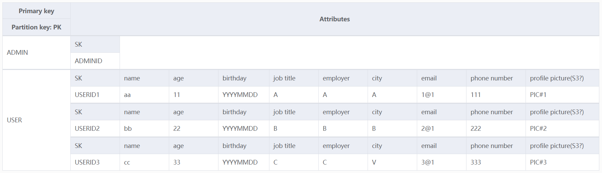
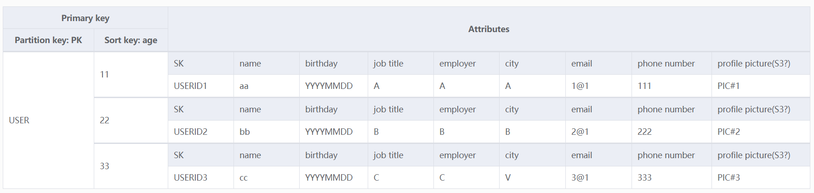
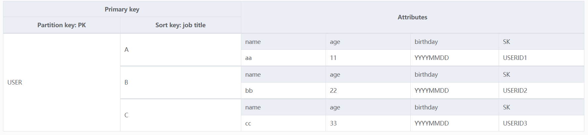
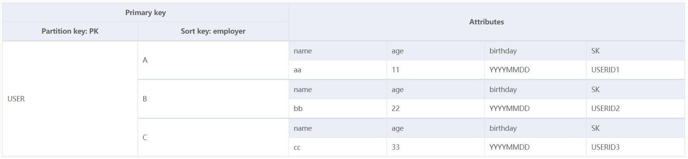
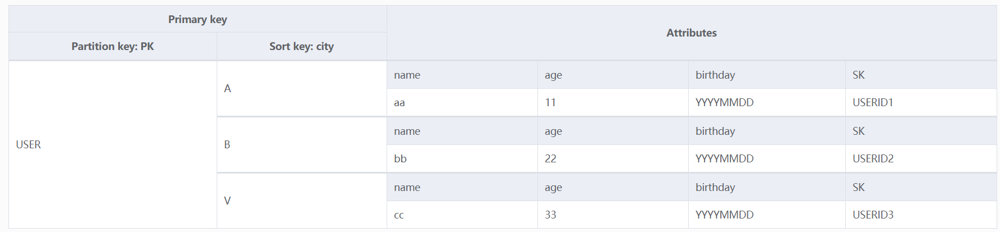

# AWS_BankSystem

## Access pattern for admin and users to manage DynamoDB.

Access for admin:
- Create table(Creat GSI)
- Create item
- Read all items
- Read items sorted by a GSI "IndexName"
- Update item
- Delete table
- Delete item

Access for user:
- Create item
- Read item
- Update item
- Delete item

Inputs from APIs RESTful method are specified in the code.

## Main table & GSIs
- Main Table

- GSI: ReadAll

- GSI: SortByAge

- GSI: SortByJobTitle

- GSI: SortByEmployer

- GSI: SortByCity

# APIs
## Admin APIs

1. Admin CreateTable:  https://zgwrzxnza6.execute-api.us-east-1.amazonaws.com/prod
2. Admin CreateItem  Invoke URL: https://cst1ia1vn8.execute-api.us-east-1.amazonaws.com/prod
3. Admin ReadAll  Invoke URL: https://v6778yb8b7.execute-api.us-east-1.amazonaws.com/prod
4. Admin ReadSorted  Invoke URL: https://0gmxvsg82j.execute-api.us-east-1.amazonaws.com/prod
5. Admin Update  Invoke URL: https://m4j2y7xsvc.execute-api.us-east-1.amazonaws.com/prod
6. Admin deleteitem  Invoke URL: https://nv7nvzk6mg.execute-api.us-east-1.amazonaws.com/prod
7. Admin deleteTable Invoke URL: https://d3bbq5ukd3.execute-api.us-east-1.amazonaws.com/prod

## User APIs
1. UserAPI createitems  Invoke URL: https://dshmqrl37d.execute-api.us-east-1.amazonaws.com/prod
2. UserAPI ReadItem Invoke URL: https://cs4s0tl30b.execute-api.us-east-1.amazonaws.com/prod
3. UserAPI UpdateItem Invoke URL: https://j24zd8iheg.execute-api.us-east-1.amazonaws.com/prod
4. UserAPI DeleteItem Invoke URL:  Invoke URL: https://zp8ej9aug4.execute-api.us-east-1.amazonaws.com/prod

# Problems remains to be solved
- If the attribute upload from API is vacant, how to deal with it.
 - assigned with None?
- How to load the profile picture? S3 Bucket?